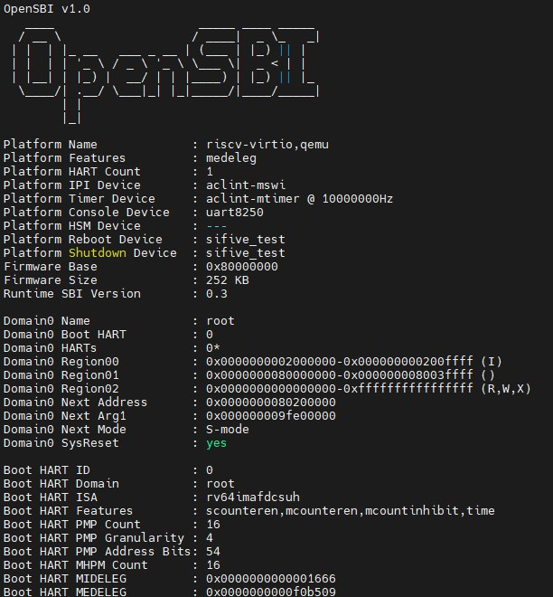
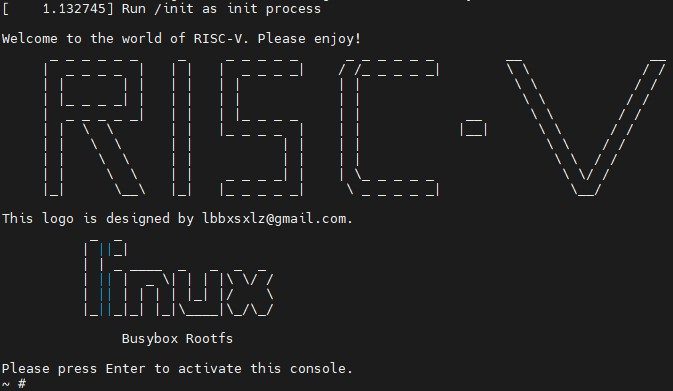

# riscv-practice
Technology Readiness for RISC-V

## RISC-V GNU Compiler Toolchain
Download and compile the RISC-V Toolchain, more detail in [riscv-toolchain](https://github.com/riscv-collab/riscv-gnu-toolchain)
```bash
git clone https://github.com/riscv/riscv-gnu-toolchain
git submodule update --init --recursive
./configure --prefix=/opt/riscv
sudo make linux -j 64
```
Add the path of compiler to your `PATH`
```bash
  export PATH=/opt/riscv/bin/:$PATH
```
Validate the compiler
```bash
  riscv64-unknown-linux-gnu-gcc -v
```

## KVM RISCV64 on QEMU




more detail in [test steps](kvm_riscv64_on_qemu/README.md)
